<h1 align="center">
  
</h1>

  
  

<table>
<tr>
<td valign="middle" width="40%">

### About
**Red Team Operator.** 
Infrastructure engagements · AD exploitation · EDR evasion.
CRTO · CRTL · Rust / C# / Python.

</td>

<td valign="middle" width="48%">

</td>
</tr>
</table>

  

  
  

